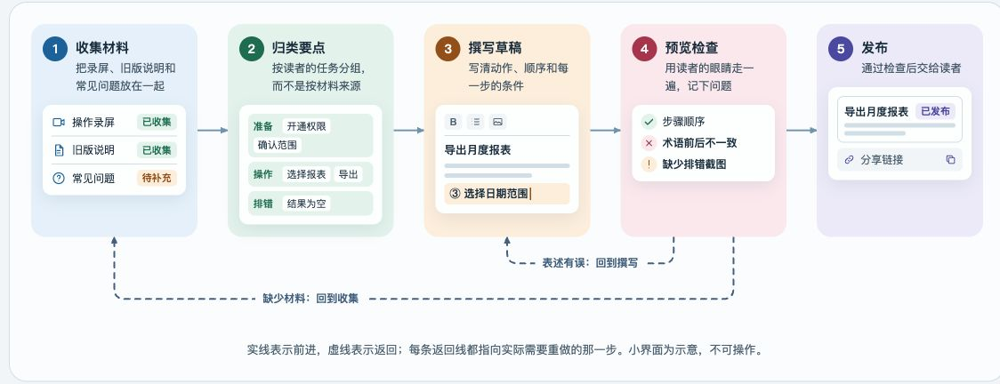
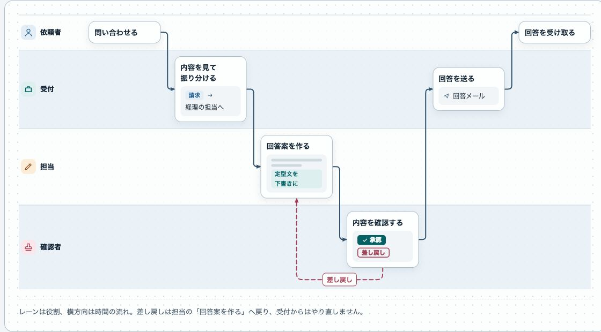
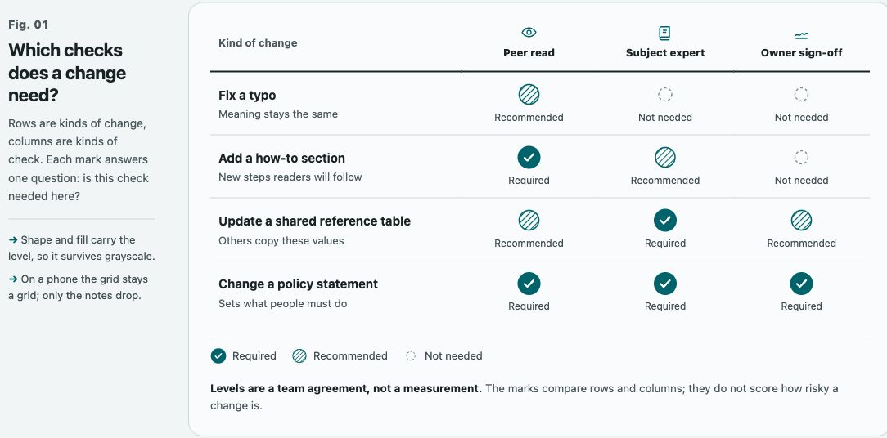
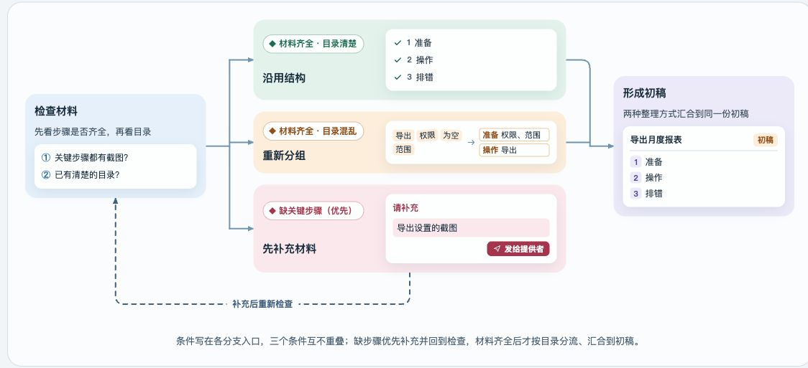
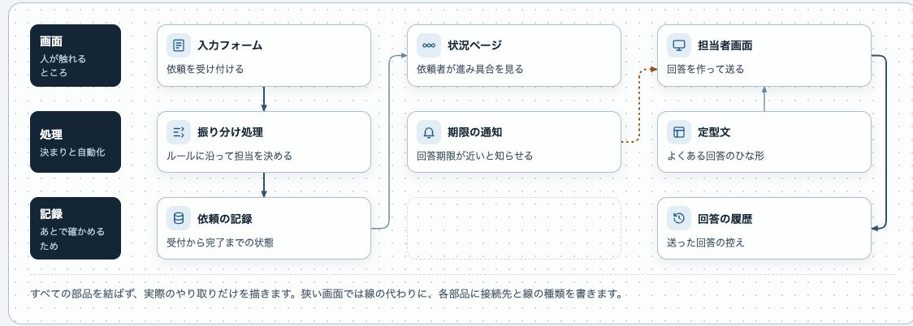
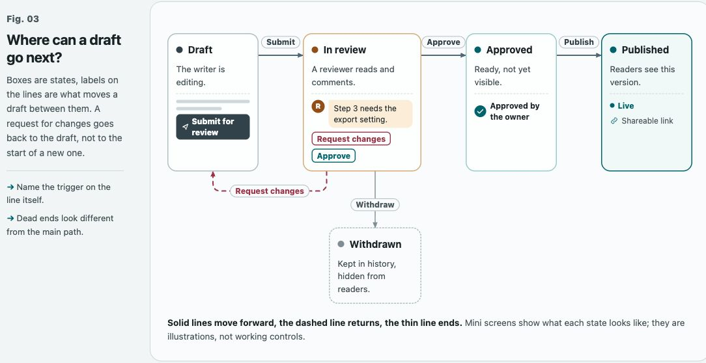

# AGENTS.md · Main-file rules and on-demand topics

[中文](README.md) · [日本語](README.ja.md) · **English**

This repository provides **14 independent topics**. Each topic's `AGENTS.zh-CN.md` and `AGENTS.md` contain its **complete text**, in Chinese and English respectively. Their filenames do not mean every topic belongs in full in the main AGENTS file.

When asked to install rules from this repository, use the two groups below. This is the default when no topics are specified; if the user selects topics, adopt only those. **Adopting rules does not install skills, enable hooks, or expand authority.**

## What can the frontend rules produce?

These real screenshots come from three webpages built using the [frontend design rules](frontend-design/AGENTS.md): two per language, showing six kinds of relationship. The editions complement one another; they are neither translations of one page nor templates for every website. Click an image to enlarge it.

<table>
  <tr><th width="33%">中文</th><th width="33%">日本語</th><th width="33%">English</th></tr>
  <tr>
    <td valign="top"><b>Steps and feedback</b><br><a href="frontend-design/references/previews/zh-flow.jpg"></a></td>
    <td valign="top"><b>Role handoff swimlanes</b><br><a href="frontend-design/references/previews/ja-swimlane.jpg"></a></td>
    <td valign="top"><b>Requirement matrix</b><br><a href="frontend-design/references/previews/en-matrix.jpg"></a></td>
  </tr>
  <tr>
    <td valign="top"><b>Branches and merge</b><br><a href="frontend-design/references/previews/zh-branch.jpg"></a></td>
    <td valign="top"><b>Layered architecture</b><br><a href="frontend-design/references/previews/ja-architecture.jpg"></a></td>
    <td valign="top"><b>State transitions</b><br><a href="frontend-design/references/previews/en-states.jpg"></a></td>
  </tr>
</table>

Full-page previews: [中文](https://primal1.sakura.ne.jp/ai-hub/examples/frontend-design/web-infographic.html) · [日本語](https://primal1.sakura.ne.jp/ai-hub/examples/frontend-design/web-infographic.ja.html) · [English](https://primal1.sakura.ne.jp/ai-hub/examples/frontend-design/web-infographic.en.html). The [HTML source files](frontend-design/references/) are included with the topic and open in a browser; all three languages can serve as visual references.

## 1. Put the complete rules directly in the main AGENTS.md

Merge the complete rules for these **9 topics** into the actual main `AGENTS.md`. They are general constraints, short conditional rules, or delegation agreements intended to remain loaded. Being always loaded does not mean taking the associated action in every task.

| Topic | What belongs in the main AGENTS.md | Complete rules |
| --- | --- | --- |
| Response status | Complete rules for seven colored, truthful statuses on a standalone final line | [中文](final-response-status/AGENTS.zh-CN.md) · [English](final-response-status/AGENTS.md) |
| Delegation & model routing | Complete rules for delegation boundaries, model selection, waiting, and review | [中文](multi-agent-delegation-and-model-routing/AGENTS.zh-CN.md) · [English](multi-agent-delegation-and-model-routing/AGENTS.md) |
| Development docs & continuity | Complete rules for document responsibilities, authoritative sources, and continuity; read actual project documents for the task | [中文](development-documentation-and-task-continuity/AGENTS.zh-CN.md) · [English](development-documentation-and-task-continuity/AGENTS.md) |
| Temporary files & structure | Complete rules for artifact placement, cleanup, and existing-file protection | [中文](temporary-files-and-project-structure-hygiene/AGENTS.zh-CN.md) · [English](temporary-files-and-project-structure-hygiene/AGENTS.md) |
| Browser tabs | Complete rules for task-tab reuse, cleanup, and protection of user tabs | [中文](browser-tab-hygiene/AGENTS.zh-CN.md) · [English](browser-tab-hygiene/AGENTS.md) |
| Keep-awake for long tasks | Complete rules for temporary use when appropriate, cleanup, and security limits | [中文](temporary-caffeine-mode-for-long-running-tasks/AGENTS.zh-CN.md) · [English](temporary-caffeine-mode-for-long-running-tasks/AGENTS.md) |
| Telegram notifications | Complete trigger and safety rules; read hook execution instructions on demand, without enabling notifications by default | [中文](telegram-notify-on-stop/AGENTS.zh-CN.md) · [English](telegram-notify-on-stop/AGENTS.md) |
| GitHub publishing | Complete rules for branches, scope, and protecting other work; no automatic publishing authorization | [中文](github-publish-discipline/AGENTS.zh-CN.md) · [English](github-publish-discipline/AGENTS.md) |
| Network fetching | Complete rules for external pacing, rate limits, and internal-operation boundaries | [中文](network-scraping-discipline/AGENTS.zh-CN.md) · [English](network-scraping-discipline/AGENTS.md) |

Choose one language and merge the selected text into the existing main file, without replacing it wholesale. Check model, tool, and platform support; changing filenames does not establish compatibility. Deduplicate equivalent existing rules, preserving and reporting actual conflicts rather than silently overriding project constraints.

Adjust relative companion links to readable locations. The hook documentation below may be referenced by its complete repository URL. Do not leave a bare `README.md` link pointing at an unrelated README beside the user's main file.

## 2. Keep only triggers in the main AGENTS.md; save full text separately

Do not merge the complete rules for these **5 topics** into the main file. Save them as ordinary Markdown beside the main `AGENTS.md` and add only the corresponding triggers below. Credential and metadata triggers also retain essential safety boundaries.

| Topic | Complete text to save separately | Filename beside the main file | Read when |
| --- | --- | --- | --- |
| Automatic case studies | [中文](case-study-and-experience-maintenance/AGENTS.zh-CN.md) · [English](case-study-and-experience-maintenance/AGENTS.md) | `CASE-STUDY.md` | Reusable errors or experience, similar-issue lookup, or case updates |
| Skill construction & private material | [中文](skill-construction/AGENTS.zh-CN.md) · [English](skill-construction/AGENTS.md) | `SKILL-CONSTRUCTION.md` | Creating, modifying, or publishing a skill; organizing guidance, workflows, and references |
| Frontend design, performance & webpage SEO | [中文](frontend-design/AGENTS.zh-CN.md) · [English](frontend-design/AGENTS.md) | `FRONTEND-DESIGN.md` | Interface design, redesign, interface-related frontend work, webpage performance, or SEO/sharing previews; relevant sections only |
| Credential handling | [中文](api-key-persistence-for-local-skills/AGENTS.zh-CN.md) · [English](api-key-persistence-for-local-skills/AGENTS.md) | `CREDENTIALS.md` | Before receiving, saving, or using passwords, keys, tokens, or other credentials |
| Document metadata | [中文](anonymous-document-artifact-metadata/AGENTS.zh-CN.md) · [English](anonymous-document-artifact-metadata/AGENTS.md) | `DOCUMENT-METADATA.md` | Before creating, editing, converting, rendering, or exporting relevant artifacts |

### Main-file trigger: automatic case studies

Save the rules in your chosen language as `CASE-STUDY.md`, then add this to the global main `AGENTS.md`:

```markdown
## Automatic case studies
- When an error, repeated failure, important fix, or newly verified experience
  has reuse value, read [Case maintenance rules](CASE-STUDY.md) and
  automatically create or update a case before finishing the task.
  Keep project cases in their projects, cross-project cases in `case-study/`
  beside this file, and skill-specific personal experience in its Private Reference.
  Also use these rules to find similar issues or reuse lessons; do not load the entire collection by default.
```

The global case directory sits beside the global main file, defaulting to `~/.codex/case-study/` for Codex. Use one Markdown file per case and a directory README for navigation. Copy the [blank Chinese index](case-study-and-experience-maintenance/templates/case-study-index.zh-CN.md) or [English index](case-study-and-experience-maintenance/templates/case-study-index.md) to `case-study/README.md`; merge with an existing index rather than overwriting it with an empty template. Project- and skill-specific cases stay in their own scopes, and actual global cases are not published with this rule collection by default. The topic defines occurrence time, last verification, issue status, and lesson applicability, with updates when later work reveals upstream fixes rather than scheduled monitoring by default.

### Main-file trigger: skill construction

Save the construction rules in your chosen language as `SKILL-CONSTRUCTION.md`, then add:

```markdown
## Skill construction: read on demand
- Before creating, modifying, or publishing a skill, read
  [Skill construction rules](SKILL-CONSTRUCTION.md), covering Guidebook,
  Workflow, Reference organization and private-material isolation.
  Do not read for other tasks.
```

The topic covers self-contained text, a routing entry point, and a Guidebook linking to Workflows. Public packages contain only private-record templates; filled personal records stay outside installed skills and public repositories. These construction rules do not install or modify existing skills.

### Main-file trigger: frontend design, performance and SEO

Save the frontend topic in your chosen language as `FRONTEND-DESIGN.md`, then add this to the main `AGENTS.md`:

```markdown
## Frontend design: read on demand
- For interface design, redesign, frontend work involving an interface,
  webpage loading and performance optimization, or SEO/sharing previews,
  read the relevant sections of
  [Frontend design rules](FRONTEND-DESIGN.md). Do not read for other tasks.
```

Skill responsibilities, compact layouts, mobile workflows, chart and interaction checks, loading performance, and SEO content delivery, metadata, and sharing requirements belong in the topic text. **Do not copy these details into the main file as well.** The topic contains only principles and checks that transfer across projects; concrete business behavior, icon compositions, content organization, dimensions, and default states belong in project design documents or specifications.

Explanatory pages or sections may use lightweight infographics on demand when diagrams clarify how something works, flows and feedback, architecture, scope, or comparisons. This is not the default appearance of every webpage. Refer to the self-contained web examples: [Chinese](frontend-design/references/web-infographic.html), [Japanese](frontend-design/references/web-infographic.ja.html), and [English](frontend-design/references/web-infographic.en.html). The three versions use complementary relationship examples and visual treatments; language does not determine design style. Render them before borrowing their expressive techniques. When copying the frontend topic, carry these three reference files with it, preserving the relative `references/` directory or adjusting the text's links. No separate static-flowchart skill is required.

### Main-file trigger: credential handling

Save the credential topic in your chosen language as `CREDENTIALS.md`, then add:

```markdown
## Credentials: read on demand
- Before receiving, saving, or using passwords, keys, tokens, or other credentials,
  read [Credential handling rules](CREDENTIALS.md).
  Follow stricter project or service requirements when applicable.
- Do not request credentials in chat or ordinary shell prompts. Plaintext must
  not enter command arguments, history, logs, tool output, replies, or skill files.
```

### Main-file trigger: document metadata

Save the metadata topic in your chosen language as `DOCUMENT-METADATA.md`, then add:

```markdown
## Document metadata: read on demand
- Before creating, editing, converting, rendering, or exporting Office, PDF,
  OpenDocument, or images carrying metadata, read
  [Document metadata rules](DOCUMENT-METADATA.md).
- Do not embed or expose identity information or local paths unless the user
  explicitly requests that exact value in this task. Before delivery, remove
  inherited personal metadata and local paths, inspect the actual artifact,
  and recheck the cleanup.
```

These blocks are the text to copy into the main file; table links point to the complete text to save separately. Paths are relative to the main `AGENTS.md`. If you use `docs/` or another directory, change the triggers accordingly. **Copying triggers without saving their referenced documents is incomplete.** Do not load a topic both in full and on demand, or give an on-demand document a main-instruction filename the runtime automatically loads.

## Installation steps for an agent on a new computer

1. Identify the main instruction path actually used by the runtime. Codex defaults to `~/.codex/AGENTS.md`; an explicitly configured Codex home takes precedence. For other agents, verify their persistent instruction entry point rather than guessing paths or claiming compatibility from renaming.
2. Read and protect existing main and adjacent documents. Choose one language, then merge the always-loaded rules, save the five topic documents, and add their triggers as above, processing only selected topics. Create necessary files if absent; do not add credentials or the author's private configuration.
3. Verify that relative trigger paths open their documents, companion links are readable, and topic text is not also inlined in the main file. Respect explicitly requested always-loaded content or other adoption methods; identify actual incompatible conflicts by location.
4. Distinguish rule adoption, skill availability, and hook state. Reading rules does not install tools; prepare the three design skills separately from their listed sources. Execute SEO, sharing-preview, and performance rules directly from the topic without installing corresponding skills. Handle hooks as described below.
5. Report the actual main-file path, merged topics, the five topic-file paths, trigger-path verification, and unmet dependencies. File existence and working links establish rule adoption, not correct execution of future tasks.

For example, adopting all topics in Codex's default directory gives:

```text
~/.codex/
├── AGENTS.md             # Group 1 complete rules + Group 2's five short triggers
├── CASE-STUDY.md         # Automatic recording, scope, and applicability; read when triggered
├── case-study/README.md  # Global case index; actual cases stay local by default, with on-demand lookup
├── SKILL-CONSTRUCTION.md # Skill organization, references, private records, and public-package boundaries
├── FRONTEND-DESIGN.md    # Design, mobile experience, loading performance, webpage SEO; relevant sections
├── CREDENTIALS.md        # Credential details; read before handling credentials
└── DOCUMENT-METADATA.md  # Metadata details; read before relevant artifact work
```

The same layout may sit beside project-level instructions. Do not install both global and project layers on the user's behalf with duplicated rules.

## Dependencies and optional hooks

- **Source:** Chinese comes from the local Chinese source and explicitly referenced details, excluding private content; English is faithful translation. Complete topic text and triggers do not establish competing rule sets.
- **Frontend design:** Design methods remain with [finesse-ui](https://github.com/mouse-lin/finesse-skill), [redesign-existing-projects](https://github.com/Leonxlnx/taste-skill), and [impeccable](https://github.com/pbakaus/impeccable). This repository neither bundles skills nor enables design hooks. Read only what the current stage needs. The frontend topic directly defines triggers, rules, and acceptance checks for SEO, sharing previews, and loading performance; these can run independently without installing another skill.
- **Models and platforms:** Routing expresses preferences by purpose and cost; the runtime must support actual models, reasoning levels, and tools. Copying rules does not expand authority or include the author's automatic commit, push, or deployment authorization.
- **Keep-awake:** It cannot guarantee protection against manual or managed locking and must not bypass passwords or security policies.

| Companion | Current status |
| --- | --- |
| [Final-response status checker](final-response-status/README.md) | Checks label format, not actual completion; does not restart the agent |
| [Telegram notifications](telegram-notify-on-stop/README.md) | The included legacy script does not meet the current task-isolation and result-summary contract; do not enable it as an implementation of the new rules |

Follow each README for installation, trust, and verification. Passing script tests does not establish actual triggering or message delivery.

## Maintenance and reuse

Preserve independent topic directories and complete Chinese/English text. Update the Chinese authoritative source first, then public text, translations, and this README's adoption instructions. Maintain one authoritative source per fact.

No license is currently included, so open-source permission is not implied. Confirm reuse terms before redistribution.
